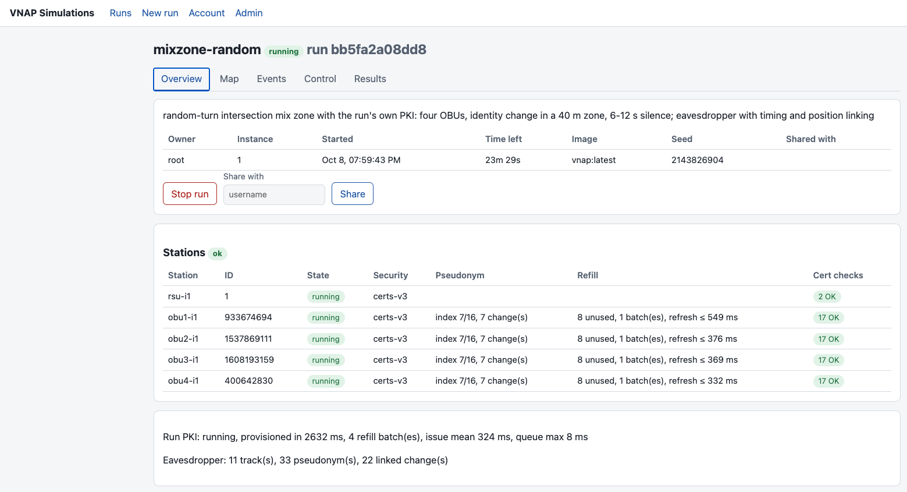
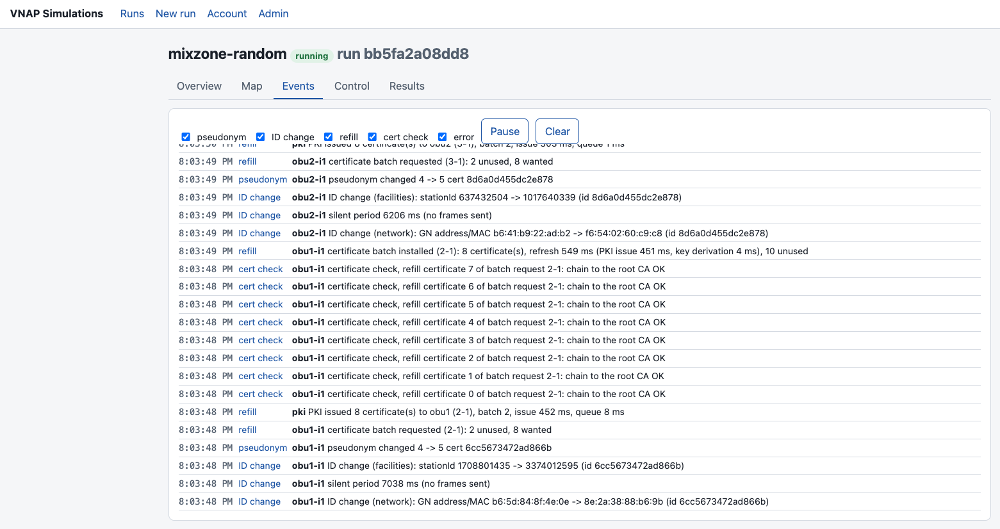
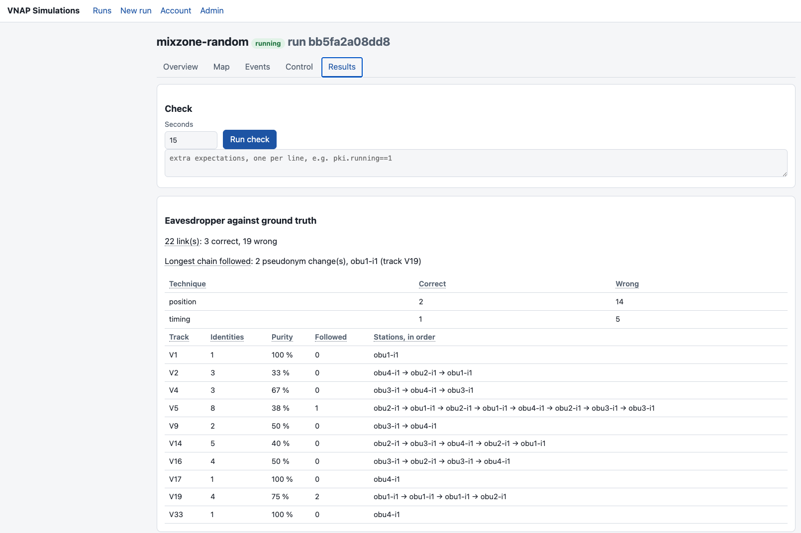

# VNAP-Secure

VNAP-Secure runs [Vanetza-NAP](https://github.com/nap-it/vanetza-nap) (`release2-main`)
V2X stations with C-ITS security enabled (ETSI TS 103 097: `certs-v2` for V1.2.1
certificates, `certs-v3` for V1.3.1 / IEEE 1609.2 certificates), and studies how well
pseudonym changes protect vehicles against tracking. It provides:

- a **patch set** for Vanetza-NAP's `socktap`:
  - full certificate-chain verification;
  - thread-safety fixes;
  - pseudonym pools with event-driven changes and ETSI ID change notification;
  - certificate refill from a PKI with on-board butterfly key derivation;
  - a runtime-controllable position;
- a **simulation harness** (`vnapctl`) that starts RSUs and OBUs from scenario files, together
  with a pseudonym control channel, a per-run PKI, a mobility client that drives the vehicles,
  and a passive eavesdropper that tries to track them;
- a **multi-user service** (HTTP API and web UI) to author, run, observe and evaluate
  scenarios without the command line.

This is not the Vanetza-NAP source tree: the build fetches it and lays the patch set over it.
Certificates come from the companion [C-ITS-PKI](https://github.com/jodyhuntatx/C-ITS-PKI)
project, included as a git submodule.

## Components

```
            vanetzalan0 (message network)                    vnapctl0 (control network)
 ┌─────┐  CAMs   ┌──────┐   ┌─────────────┐        ┌───────────────┐  ┌───────────────────┐
 │ RSU │◀───────▶│ OBUs │   │ eavesdropper│        │ control broker│◀─│ event client,     │
 └─────┘         └──┬───┘   │ (passive)   │        │ (MQTT)        │  │ mobility client   │
                    │       └─────────────┘        └──────┬────────┘  └───────────────────┘
                    └── pseudonym events, positions, ─────┘    ┌──────────────┐
                        certificate batches ◀──────────────────│ per-run PKI  │
                                                               └──────────────┘
   vnapctl (sim/) starts and inspects a run; the service (service/) does the same for many users
```

| Component | What it does | Documentation |
|---|---|---|
| Stations (`vnap:latest`) | patched `socktap`: signed CAMs, chain verification, pseudonym changes, refill | [security](docs/functional/security-and-chain-verification.md), [pseudonym change](docs/functional/pseudonym-change.md) |
| Per-run PKI (`vnap-pki`) | the run's CA hierarchy; issues butterfly authorization tickets in batches | [certificate refill](docs/functional/certificate-refill.md) |
| Mobility client (`vnap-mobility`) | drives vehicles along routes or random-turn crossings; mix zones | [vehicle movement](docs/functional/vehicle-movement.md) |
| Eavesdropper (`vnap-eavesdropper`) | passive tracking attacker; scored against ground truth | [eavesdropper and scoring](docs/functional/eavesdropper-and-scoring.md) |
| `vnapctl` / `vnapsim` | scenario validation, start/stop, status, events, checks | [vnapctl](docs/operations/vnapctl.md) |
| Service | accounts, runs, live view, control, results, backups; web UI | [deployment](docs/operations/service-deployment.md), [web UI](docs/operations/web-ui.md) |

The whole picture, with networks and trust boundaries, is in [docs/architecture.md](docs/architecture.md).

## Repository layout

| Path | Content |
|---|---|
| `patches/vanetza-nap/` | the patch set: `modified/` files, their `upstream/` originals, generated `diffs/`, the upstream `BASE` commit |
| `sim/` | `vnapctl` and the `vnapsim` package, `scenarios/` (and `templates/`), helper images in `images/`, the user policy, tests |
| `service/` | the HTTP API (`vnapapi/`), web UI (`ui/`), deployment files (`deploy/`), configuration, tests |
| `certs/` | committed **test** certificate sets: `certify/` (v2) and `c-its-pki/` (v3) |
| `external/C-ITS-PKI/` | git submodule: the PKI library used by the per-run PKI |
| `scripts/` | `build/` (image, diffs), `vm/` (development VM helpers), `certs/` (certify tools), `docs-check.py` |
| `docs/` | installation, build, operations, reference, functional descriptions, patch documentation |
| `results/` | test summaries of the privacy scenarios |
| `Specs/` | product requirements, privacy paper, the repository plan |

## Requirements

- **An Ubuntu VM** (24.04; development used VMware on a Mac). Vanetza-NAP has file names that
  differ only by case, so it cannot be built on a case-insensitive file system.
- **Docker, git, make, python3 ≥ 3.11** in the VM.
- **About 10 GB of free disk** for the first image build.
- **Access to GitHub:** the C-ITS-PKI submodule and the upstream vanetza-nap sources.

## Installation

```bash
git clone --recurse-submodules git@github.com:jodyhuntatx/vnap-secure.git ~/COIMBRA/vnap-secure
cd ~/COIMBRA/vnap-secure
git submodule update --init      # in a clone made without --recurse-submodules
```

Shared folders from the host, snap-confined Docker, git on `/mnt/hgfs` and disk sizing are
covered in [docs/installation.md](docs/installation.md).

## Build

```bash
make image          # fetch vanetza-nap at patches/vanetza-nap/BASE into ~/vanetza-nap, apply the patches, build vnap:latest
docker run --rm --entrypoint /usr/local/bin/socktap vnap:latest --help | grep pseudonym-control   # patched?
make msgcheck       # optional: the offline message checker vnap:msgcheck
```

- **Time:** the first build takes about 20 minutes; later builds reuse cached layers.
- **Helper images** (PKI, mobility client, eavesdropper, control client) are built by
  `vnapctl` on demand.
- **Details:** `VANETZA_NAP_DIR` and `IMAGE`, building the unpatched sources (`make origs`) and
  releasing an image tag are in [docs/build.md](docs/build.md).

## Run a simulation

From `sim/`:

```bash
cd sim
./vnapctl scenarios                       # the scenario catalogue
./vnapctl up c-its-pki                    # validate, start, wait until the stations exchange messages
./vnapctl status                          # stations, certificates, chain checks
./vnapctl check                           # observe 15 s: PASS/FAIL against the expectations
./vnapctl events --duration 10s           # received/sent messages, pseudonym and PKI events
./vnapctl down                            # remove containers, networks and the run's keys
```

Other scenarios to try:
- `c-its-pki-mixzone-random`: four cars changing identity in a mix zone, watched by an
  eavesdropper.
- `templates/pki-refill`: the run's own PKI with certificate refill.

`--instance auto` runs a second, independent simulation next to the default one.

- **Overrides and instances:** [docs/operations/vnapctl.md](docs/operations/vnapctl.md).
- **Scenario format:** [docs/reference/scenario-format.md](docs/reference/scenario-format.md).

## Run the service

```bash
cd service
python3 -m vnapapi.admin create-user root --role admin   # first admin (password asked, or VNAP_NEW_PASSWORD)
./run.sh                                                 # 0.0.0.0:8080, web UI at /ui/, API docs at /api/docs
```

The service listens on all interfaces (`0.0.0.0`) by default. This is required when port 8080
is forwarded from the VM to the host (e.g. to open the UI at `http://localhost:8080` on a
Mac). Set `VNAP_API_HOST=127.0.0.1` to listen on the VM only.

In production the service runs as a dedicated account under systemd, behind Caddy for TLS
(`service/deploy/`). See [docs/operations/service-deployment.md](docs/operations/service-deployment.md),
then [docs/operations/web-ui.md](docs/operations/web-ui.md) for users.






## Operate

- **Monitoring:** decoded messages over MQTT, frames with tcpdump/Wireshark, events and logs.
  See [docs/operations/monitoring.md](docs/operations/monitoring.md).
- **Backups and restore:** daily archives, the restore runbook, and custody of the TOTP key.
  See [docs/operations/backup-restore.md](docs/operations/backup-restore.md).
- **Troubleshooting:** startup chain checks, offline message checks, known limitations.
  See [docs/operations/troubleshooting.md](docs/operations/troubleshooting.md).

## Tests

```bash
make test        # vnapsim and service unit tests, web UI syntax, patch diffs current, documentation links
```

None of these need a running simulation. Changes that affect running stations are checked
with live scenario runs (`vnapctl up … && vnapctl check`), as described per component in the
docs.

## Documentation

| Area | Documents |
|---|---|
| Setup | [installation](docs/installation.md) · [build](docs/build.md) · [architecture](docs/architecture.md) · [certificates](docs/certificates.md) |
| Operations | [vnapctl](docs/operations/vnapctl.md) · [service deployment](docs/operations/service-deployment.md) · [web UI](docs/operations/web-ui.md) · [backup and restore](docs/operations/backup-restore.md) · [monitoring](docs/operations/monitoring.md) · [troubleshooting](docs/operations/troubleshooting.md) |
| Reference | [scenario format](docs/reference/scenario-format.md) · [configuration](docs/reference/configuration.md) · [container environment](docs/reference/container-environment.md) · [control channels](docs/reference/control-channels.md) · [API](docs/reference/api.md) |
| How it works | [security and chain verification](docs/functional/security-and-chain-verification.md) · [pseudonym change](docs/functional/pseudonym-change.md) · [certificate refill](docs/functional/certificate-refill.md) · [vehicle movement](docs/functional/vehicle-movement.md) · [eavesdropper and scoring](docs/functional/eavesdropper-and-scoring.md) |
| Patch set | [patch documentation](docs/patches/README.md) |
| Results | [test summaries](results/README.md) |
| Specifications | `Specs/VNAP-Secure-Simulation-Service-PRD.pdf`, `Specs/VNAP-Secure-Repository-Reorganization-Plan.docx` |

The general Vanetza-NAP documentation (configuration, MQTT/JSON formats, applications) is in
the vanetza-nap tree (`docs/`) and at
<https://wiki.nap.av.it.pt/groups/nap/tutorials/vanetza-nap/>; it does not cover security.

## Versions

The current station image is `vnap:r2-p19` (also `vnap:latest`). Image tags, features by
date and the history of this repository are in [CHANGELOG.md](CHANGELOG.md).

**Moved sections.** The sections of the earlier single README are now in `docs/`; the
[changelog](CHANGELOG.md#documentation-moves) maps each old section to its new place.
